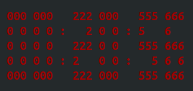

# Ncurses cpp based ASCII Digital Clock

Basic ASCII Digital Clock implementation using ncurses.

Updates every 100ms.

    

## Compile and run

    g++ ncurses_digital_clock.cpp -lncurses -o ncurses_digital_clock
    ./ncurses_digital_clock
